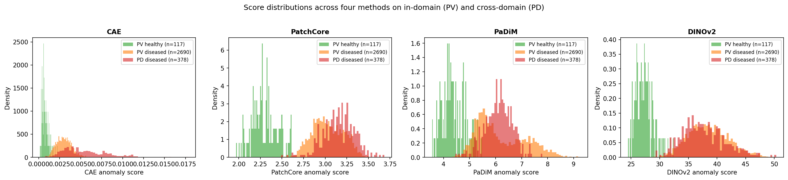
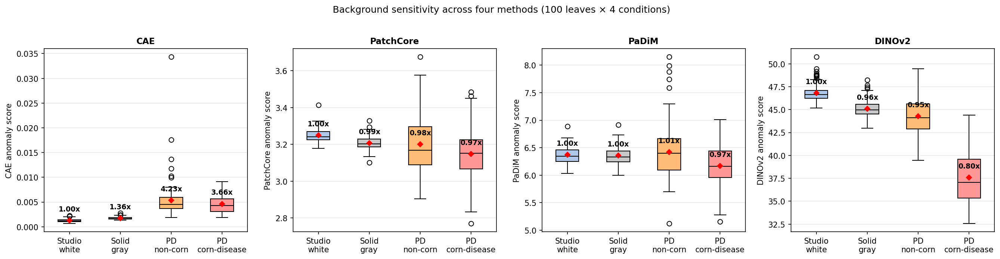
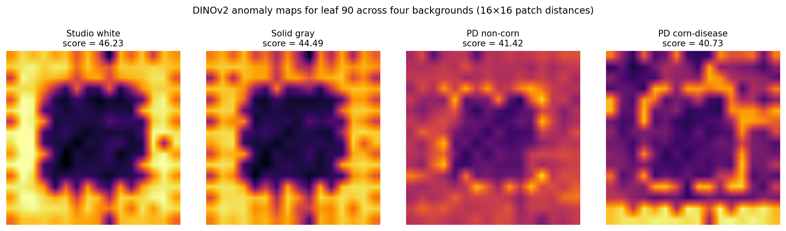

# CropAnomalyNet

Unsupervised maize disease detection via reconstruction-based and pretrained-feature anomaly detection, with cross-domain evaluation on PlantDoc field imagery and a controlled background-sensitivity experiment that isolates architecture-dependent failure modes that cross-domain AUROC cannot diagnose.

**Status:** All seven notebooks (NB1–NB7) complete. Three pretrained-feature methods evaluated (PatchCore, PaDiM, DINOv2) across two backbone families (WideResNet50, ViT-S/14) and two pretraining paradigms (ImageNet-1K supervised, LVD-142M self-supervised). Paper draft v1.1 ready for Zenodo submission.

## Motivation

Supervised crop disease classifiers require thousands of labeled examples per class. We reframe the problem as anomaly detection: train only on healthy leaf images, then flag deviations as diseased. This mirrors industrial defect inspection — abundant normal samples, very few labeled defects. We then test whether lab-trained anomaly detectors transfer to real-world field imagery, design a controlled experiment to identify which failure modes arise, and test whether the answer depends on the choice of pretrained backbone.

## Pipeline

| Notebook | Method                                          | Status | Result                                                |
| -------- | ----------------------------------------------- | ------ | ----------------------------------------------------- |
| NB1      | Convolutional Autoencoder (MSE reconstruction)  | Done   | AUROC 0.9942                                          |
| NB2      | PatchCore (WR50 layer-2+3, mean-aggregated)     | Done   | AUROC **0.9995**                                      |
| NB3      | Stable Diffusion synthesis evaluation           | Done   | **Negative finding** (FID 323–375)                    |
| NB4      | PlantDoc cross-domain evaluation                | Done   | PatchCore PV→PD ratio **1.05×** (flat)                |
| NB5      | Background-sensitivity controlled experiment    | Done   | CAE **4.00×** vs PatchCore **0.97×** background ratio |
| NB6      | Three-method comprehensive eval + stats (PaDiM) | Done   | PaDiM tracks PatchCore (variance ratio 0.38)          |
| NB7      | DINOv2 ViT-S/14 cross-architecture ablation     | Done   | DINOv2 reveals **third regime** (variance ratio 2.47, opposite direction from CAE) |

## Headline result: three regimes, not two

The controlled background-sensitivity experiment (NB5–NB7) reveals that pretrained-feature anomaly detectors do not behave as a single family. The variance-decomposition ratio (cross-condition movement of the mean divided by within-condition leaf-to-leaf spread) cleaves the four methods into three regimes:

| Regime                 | Methods                  | Variance ratio | Direction | Deployment failure mode    |
| ---------------------- | ------------------------ | -------------- | --------- | -------------------------- |
| Background-inflating   | CAE                      | 1.32 (above noise) | upward    | false positives on field   |
| Background-invariant   | PatchCore, PaDiM         | 0.46, 0.38 (sub-noise) | small, downward | none observed             |
| Background-deflating   | DINOv2                   | 2.47 (above noise) | strongly downward | false negatives on field (healthy looks normal) |

All three pretrained-feature methods achieve cross-domain AUROC above 0.99 on PlantDoc maize. None inflate scores on field imagery the way the CAE does. The controlled experiment shows that DINOv2's stronger pretraining distribution (LVD-142M self-supervised) is a liability for field anomaly detection: natural-image patches sit so close to its coreset of healthy training patches that the leaf-versus-background discrimination weakens. WR50/ImageNet-supervised features avoid this failure mode. **Cross-domain AUROC alone cannot diagnose either failure mode; the controlled experiment is required.**

## Dataset

PlantVillage (Hughes & Salathé, 2015), maize subset, color version. Four classes:

| Class                            | Count |
| -------------------------------- | ----- |
| Corn healthy                     | 1,162 |
| Corn Common rust                 | 1,192 |
| Corn Cercospora (Gray leaf spot) | 513   |
| Corn Northern Leaf Blight        | 985   |

For NB4, NB6, and NB7 cross-domain evaluation, we additionally use **PlantDoc** (Singh et al. 2020) maize subset:

| PlantDoc class      | Count | Maps to              |
| ------------------- | ----- | -------------------- |
| Corn_rust_leaf      | 117   | Common rust          |
| Corn_leaf_blight    | 194   | Northern Leaf Blight |
| Corn_Gray_leaf_spot | 67    | Cercospora           |

PlantDoc has no healthy corn class. The score-magnitude analysis in NB4/NB6/NB7 and the controlled experiment in NB5–NB7 work around this absence.

Splits (canonical, in `results/nb1/splits.csv`):

- Train: 929 healthy
- Val: 116 healthy
- Test: 117 healthy + 2,690 diseased (NB1/NB2) or + 2,690 PV + 378 PD diseased (NB4/NB6/NB7)

All notebooks reuse identical splits (deterministic via shared seed 42).

## Results — PlantVillage maize (in-domain)

Per-class test AUROC. NB6 adds PaDiM, NB7 adds DINOv2 ViT-S/14:

| Class                | Brightness-only | CAE        | PatchCore-mean | PaDiM      | DINOv2     |
| -------------------- | --------------- | ---------- | -------------- | ---------- | ---------- |
| Common rust          | 0.9175          | 0.9996     | **1.0000**     | 0.9926     | 0.9994     |
| Cercospora           | 0.6853          | 0.9948     | 0.9994         | 0.9915     | **0.9996** |
| Northern Leaf Blight | 0.6849          | 0.9874     | **0.9990**     | 0.9931     | 0.9981     |
| **Overall**          | **0.7880**      | **0.9945** | **0.9995**     | **0.9811** | **0.9991** |

DINOv2 ties PatchCore on overall AUROC within bootstrap noise (CIs [0.9990, 0.9998] for PatchCore vs [0.9983, 0.9997] for DINOv2). PaDiM trails because the per-position Gaussian fit with 100 random feature dimensions is less expressive than nearest-neighbor matching in the full feature space; AUROC strength and domain robustness are separate properties.

## Results — Cross-domain on PlantDoc (NB4, NB6, NB7)

Bootstrap 95% AUROC confidence intervals (2000 stratified resamples):

| Comparison       | CAE                       | PatchCore                  | PaDiM                      | DINOv2                     |
| ---------------- | ------------------------- | -------------------------- | -------------------------- | -------------------------- |
| In-domain        | 0.9945 [0.9897, 0.9982]   | **0.9995 [0.9990, 0.9998]** | 0.9811 [0.9719, 0.9890]   | 0.9991 [0.9983, 0.9997]   |
| Cross-domain     | 0.9968 [0.9931, 0.9993]   | **0.9995 [0.9986, 1.0000]** | 0.9927 [0.9870, 0.9968]   | 0.9985 [0.9966, 0.9997]   |
| Unified          | 0.9948 [0.9904, 0.9981]   | **0.9995 [0.9991, 0.9998]** | 0.9825 [0.9742, 0.9898]   | 0.9990 [0.9982, 0.9997]   |

The CAE's in-domain and cross-domain CIs overlap by more than half their width. Bootstrap does not distinguish the two conditions for the CAE, even though the point estimates differ by 0.0023. **Cross-domain AUROC is not the right headline metric on this setup.** The real cross-domain story lives in the score magnitudes.

### Score-magnitude ratios PV→PD (mean PD-diseased score / mean PV-diseased score, same disease class)

| Method        | Common rust | Cercospora | N. Blight | Mean       |
| ------------- | ----------- | ---------- | --------- | ---------- |
| **CAE**       | 1.35×       | 1.90×      | 2.46×     | **1.90×** (inflated) |
| **PatchCore** | 1.00×       | 1.07×      | 1.09×     | **1.05×** (flat)     |
| **PaDiM**     | 0.85×       | 1.08×      | 1.14×     | **1.03×** (flat)     |
| **DINOv2**    | 0.95×       | 0.97×      | 1.01×     | **0.98×** (flat)     |

All three pretrained-feature methods produce flat per-class ratios. The CAE inflates by 1.4–2.5×. By this analysis DINOv2 looks like the most domain-invariant method of the four. The controlled experiment below shows the flatness is a confounded result, not a sign of disease-only detection.

### Score std ratios (PD diseased / PV diseased)

| Method    | PV std | PD std | Std ratio                            |
| --------- | ------ | ------ | ------------------------------------ |
| CAE       | 0.0009 | 0.0026 | **2.96×** (variance explodes)        |
| PatchCore | 0.1806 | 0.1806 | **1.00×** (identical)                |
| PaDiM     | 0.9517 | 0.5096 | **0.54×** (contracts on field)       |
| DINOv2    | 3.5346 | 3.7264 | **1.05×** (essentially identical)    |



## Results — Background-sensitivity controlled experiment (NB5, NB6, NB7)

Same healthy leaf, four backgrounds of increasing visual distance from the PlantVillage studio. NB7 adds DINOv2 as a fourth method.

**Mean anomaly score per condition** (n=100 leaves per condition; ratios to studio_white baseline in parentheses):

| Condition           | CAE                | PatchCore         | PaDiM             | DINOv2            |
| ------------------- | ------------------ | ----------------- | ----------------- | ----------------- |
| Studio white        | 0.00126 (1.00×)    | 3.2493 (1.00×)    | 6.3727 (1.00×)    | 46.8218 (1.00×)   |
| Solid gray          | 0.00171 (1.36×)    | 3.2067 (0.99×)    | 6.3555 (1.00×)    | 45.0971 (0.96×)   |
| PD non-corn         | 0.00533 (**4.23×**)| 3.2004 (0.98×)    | 6.4212 (1.01×)    | 44.2878 (0.95×)   |
| PD corn-disease     | 0.00462 (3.66×)    | 3.1467 (0.97×)    | 6.1655 (0.97×)    | 37.5902 (**0.80×**) |

The CAE inflates up to 4.23× across conditions. PatchCore and PaDiM stay within 3% of baseline. DINOv2 deflates by 20% on the most natural background, opposite direction to the CAE but comparable in magnitude.



### Statistical robustness (NB6, NB7)

**Paired t-tests** on the 100-leaf matched design with studio_white as baseline. Cohen's d is the relevant column at n=100 because power is high enough to push small effects below p=0.05; d separates "real magnitude" from "consistent micro-shift."

| Method        | solid_gray      | pd_non_corn     | pd_corn_disease     |
| ------------- | --------------- | --------------- | ------------------- |
| **CAE**       | d=**+2.43**, p<10⁻⁴² | d=**+1.13**, p<10⁻¹⁸ | d=**+1.77**, p<10⁻³¹ |
| **PatchCore** | d=−2.08, p<10⁻³⁷ | d=−0.33, p=0.0015 | d=−0.77, p<10⁻¹⁰    |
| **PaDiM**     | d=−0.29, p=0.005 | d=+0.11, p=0.29 (n.s.) | d=−0.56, p<10⁻⁶  |
| **DINOv2**    | d=**−3.09**, p<10⁻⁵¹ | d=**−1.24**, p<10⁻²¹ | d=**−3.56**, p<10⁻⁵⁷ |

CAE effect sizes are uniformly positive and large to very large. PatchCore and PaDiM effect sizes are mostly small in magnitude, mixed in sign. DINOv2 effect sizes are uniformly negative and large to very large, with the largest paired effect of any method × condition in the study (d=−3.56 on pd_corn_disease).

**Variance decomposition** — cross-condition movement of the mean divided by within-condition leaf-to-leaf spread. A ratio above 1 means the background effect exceeds per-leaf noise within a single condition.

| Method        | Mean within-condition std | Across-condition mean std | Ratio (across / within) | Status                       |
| ------------- | ------------------------- | ------------------------- | ----------------------- | ---------------------------- |
| **CAE**       | 0.00155                   | 0.00204                   | **1.32**                | above noise floor (inflates) |
| **PatchCore** | 0.09117                   | 0.04207                   | **0.46**                | sub-noise                    |
| **PaDiM**     | 0.29651                   | 0.11232                   | **0.38**                | sub-noise                    |
| **DINOv2**    | 1.63880                   | 4.04650                   | **2.47**                | above noise floor (deflates) |

Two methods cross the noise floor: the CAE (upward) and DINOv2 (downward). Two methods stay sub-noise: PatchCore and PaDiM. The cleavage does not track "reconstruction vs pretrained" or "old vs new"; it tracks the breadth of the backbone's pretraining distribution. DINOv2's broader natural-image pretraining gives it features that find field-style imagery so familiar that the background dominates the leaf signal.

### DINOv2 anomaly map visualization (NB7)



DINOv2 patch distances for one representative healthy leaf across the four conditions. The leaf-shaped low-distance region (dark center) stays roughly constant in position, but the surrounding patch distances drop substantially as the background becomes more natural. By the pd_corn_disease condition, the leaf-versus-background contrast in the map has compressed because both regions sit close to DINOv2's coreset of healthy training patches.

### Why DINOv2's flat PV→PD score-magnitude ratios were misleading

DINOv2's flat 0.95–1.01× ratios on the real PD test set are a confounded result. Real PD diseased images contain both disease (which pushes DINOv2 scores up) and natural backgrounds (which pulls them down). The two effects roughly cancel, producing per-class ratios that look like clean cross-domain behavior. The controlled experiment holds the leaf constant and isolates the background effect alone, revealing the 0.80× deflation that the natural test set hides.

The deployment implication: a healthy field leaf scores at 37.59 under DINOv2 (controlled experiment, PD corn-disease background). Real PD diseased leaves score at 36.59–38.23 (unified test set, per class). These overlap. DINOv2 cannot, on average, distinguish a healthy field leaf from a diseased field leaf. The high cross-domain AUROC against the PV-healthy reference (0.9985) reflects the gap between studio-background healthy and natural-background anything, not disease detection per se.

PatchCore exhibits the same structural confound at a much smaller scale: PV healthy 2.30, PD diseased 3.13–3.17, healthy-on-PD-bg composite 3.15. The overlap is smaller and the within-condition spread is also tighter, so PatchCore would separate (modestly) on a real PD-healthy vs PD-diseased comparison if such a dataset existed.

### Key findings

1. **PatchCore-mean matches or exceeds the CAE on every class in-domain** while operating on ImageNet-pretrained features. Largest gain is on Northern Leaf Blight (+0.0116), the hardest class for both methods.

2. **Score aggregation matters substantially for diffuse anomalies.** PatchCore's standard `max` patch distance (calibrated for localized industrial defects on MVTec) scores 0.9536 on this data. `mean` aggregation recovers full performance (0.9995). The aggregation choice moves the result more than the choice between reconstruction and pretrained-feature methods does.

   | Aggregation                  | Overall AUROC |
   | ---------------------------- | ------------- |
   | max (PatchCore default)      | 0.9536        |
   | mean                         | **0.9995**    |
   | top-10% mean                 | 0.9967        |
   | top-1% mean                  | 0.9817        |
   | center max (4-pixel margin)  | 0.9904        |
   | center mean (4-pixel margin) | 0.9995        |

3. **Brightness alone is insufficient** (overall 0.7880). Color carries most of the Common Rust signal (0.9175) but is barely above chance for Cercospora and Northern Blight (~0.685). Both learned methods do real texture-based detection on the harder classes.

4. **Off-the-shelf Stable Diffusion v1.5 cannot synthesize convincing maize disease imagery** (NB3). Across four pipeline configurations, FID against real disease ranged 323–375 versus a healthy intra-class baseline of 32, an order of magnitude off-distribution.

5. **Cross-domain AUROC is a misleading headline metric on this setup.** Bootstrap CIs show the CAE's in-domain and cross-domain AUROC do not differ. DINOv2's flat per-class score-magnitude ratios hide a 20% controlled-experiment downshift. AUROC against a fixed in-domain healthy reference cannot diagnose architecture-dependent background sensitivity.

6. **The controlled background experiment cleaves the four methods into three regimes** (NB7). The CAE inflates 4.23× (variance ratio 1.32, false positives on field). PatchCore and PaDiM stay within 3% of baseline (variance ratios 0.46 and 0.38, sub-noise). DINOv2 deflates by 20% on pd_corn_disease (variance ratio 2.47, false negatives on field). The regimes do not track "reconstruction vs pretrained" or "supervised vs self-supervised" cleanly; they track the breadth of the backbone's pretraining distribution.

7. **Cross-architecture generalization is not a property of "pretrained features" in general.** WR50/ImageNet-supervised features are background-invariant at the magnitudes tested. ViT-S/14/LVD-142M-self-supervised features are background-sensitive in the opposite direction to the CAE. The deployment recommendation narrows from "use a pretrained-feature method" to "use a WR50-family pretrained-feature method." More pretraining does not automatically improve cross-domain anomaly detection on this task.

8. **The controlled experiment is necessary, not optional.** Three of the four methods produce excellent cross-domain AUROC. Only the controlled experiment exposes the architecture-specific failure modes that cause two of those three methods (CAE upward, DINOv2 downward) to behave badly on out-of-distribution leaves. Cross-domain anomaly detection evaluations should include a controlled stimulus check by default where the domain shift can be deconstructed.

## NB1 — Convolutional Autoencoder

Vanilla CAE (1.08M params) trained on 929 healthy maize images for ~45 epochs with early stopping. Output in `[0, 1]` via sigmoid; MSE loss; Adam at lr=1e-3 with `ReduceLROnPlateau`.

Per-pixel reconstruction-error maps localize to lesion regions (`results/nb1/cae_reconstructions.png`), indicating genuine texture-based reconstruction failure rather than just global brightness mismatch.

Artifacts in `results/nb1/`:

- `cae_score_histogram.png`, `cae_roc.png`, `cae_reconstructions.png`
- `cae_test_scores.csv`, `splits.csv`
- Checkpoint: `checkpoints/cae_best.pt` (4 MB, included)

## NB2 — PatchCore

WideResNet50 ImageNet-pretrained backbone, frozen. Features from layer 2 (28×28×512) and layer 3 (14×14×1024) captured via forward hooks; layer 3 upsampled to 28×28 via bilinear interpolation, concatenated channel-wise with layer 2, then 3×3 average-pooled for neighborhood-aware patches (Roth et al. 2022). Each image yields 784 patches × 1536 dims.

Memory bank: 728,336 patches from 929 healthy training images. Reduced to 10% (72,833 patches) via greedy farthest-point coreset sampling on Johnson-Lindenstrauss-projected (128-dim) features.

Inference: `torch.cdist` between test patches and coreset bank, minimum over the coreset gives a 28×28 anomaly map per image, **mean** over the 784 patches gives the image-level anomaly score.

Artifacts in `results/nb2/`:

- `patchcore_score_histogram.png`, `patchcore_roc.png`, `patchcore_anomaly_maps.png`
- `patchcore_test_scores.csv` (columns: `score_max`, `score_mean`)
- `brightness_baseline_scores.csv`
- Coreset memory bank (~447 MB) regenerable from notebook cells 4–7; excluded via `.gitignore`.

## NB3 — Stable Diffusion synthesis evaluation

Four configurations of Stable Diffusion v1.5 tested on PlantVillage healthy bases:

1. img2img with descriptive prompts (strength 0.2–0.6)
2. ControlNet (Canny edges) standalone
3. ControlNet + img2img
4. ControlNet with visual-symptom-only prompts (no disease vocabulary)

All four failed to produce convincing maize disease imagery. Failure modes:

- **Wrong species** at high denoising strength: broadleaf garden plants, autumn fallen leaves, rubber plants with pinnate venation.
- **Misinterpreted disease vocabulary**: "rust" → rusted metal scales / beetle exoskeletons; "pustules" → broccoli florets.
- **No disease added** at low strength: output essentially preserves the healthy input.

Quantitative results (FID, 50 synthetic vs 200 real per class):

| Comparison                                                    | FID      |
| ------------------------------------------------------------- | -------- |
| Healthy maize, half-A vs half-B (intra-distribution baseline) | **32.2** |
| Synthetic common rust vs real common rust                     | 352.0    |
| Synthetic Cercospora vs real Cercospora                       | 374.9    |
| Synthetic Northern Blight vs real Northern Blight             | 323.8    |

Synthetic-vs-real FID is roughly an order of magnitude above the healthy intra-class baseline. Vanilla SD v1.5 cannot produce in-distribution maize disease imagery via prompt engineering alone. Domain adaptation (LoRA, fine-tuning, or paired-image conditioning like Dreambooth) would be required.

Artifacts in `results/nb3/`:

- Iteration grids: `sd_sanity_check.png`, `sd_strength_sweep.png`, `sd_controlnet_sweep.png`, `sd_controlnet_img2img_sweep.png`, `sd_final_attempt.png`
- `synthetic_samples.png`, `synthetic_samples/` (15 sample images), `fid_results.json`

## NB4 — Cross-domain evaluation on PlantDoc

We test whether the CAE and PatchCore, trained or built only on PlantVillage's studio healthy images, generalize to real-world maize disease imagery from PlantDoc. PlantDoc has no healthy corn class, so a pure PD-healthy-vs-PD-diseased AUROC is not computable; we evaluate the deployment scenario directly: PV healthy training images as the normal reference, vs three test conditions (in-domain PV diseased, cross-domain PD diseased, and the union).

Test set: 117 PV healthy + 2,690 PV diseased + 378 PD diseased = 3,185 images.

NB6 and NB7 supersede NB4 by adding PaDiM, DINOv2, and bootstrap confidence intervals. The score-magnitude analysis remains the central finding from this notebook.

### Score-magnitude evidence

CAE reconstruction error (mean per class):

| Class           | PV diseased | PD diseased | Ratio |
| --------------- | ----------- | ----------- | ----- |
| Common rust     | 0.00347     | 0.00476     | 1.37× |
| Cercospora      | 0.00282     | 0.00547     | 1.94× |
| Northern blight | 0.00231     | 0.00574     | 2.48× |

PlantDoc images produce reconstruction errors 1.4–2.5× larger than PlantVillage diseased images *for the same underlying disease class*. The CAE conflates disease with background novelty.

PatchCore mean-aggregated score:

| Class           | PV diseased | PD diseased | Ratio  |
| --------------- | ----------- | ----------- | ------ |
| Common rust     | 3.1754      | 3.1608      | 0.995× |
| Cercospora      | 2.9342      | 3.1271      | 1.066× |
| Northern blight | 2.8999      | 3.1685      | 1.093× |

PatchCore's per-class score magnitudes are flat across domains.

### Mechanism

PatchCore uses ImageNet-pretrained WideResNet50 features. ImageNet contains diverse real-world imagery (outdoor scenes, dirt, hands, varied lighting), so these features remain discriminative for plant disease texture across the lab-vs-field gap. The CAE, trained from scratch on PlantVillage studio healthy images only, has no such prior exposure to field-style imagery and learns reconstruction filters tuned to the studio distribution. NB5 confirms this mechanism via the controlled experiment. NB7 shows the same mechanism produces the opposite failure mode in DINOv2: its much broader pretraining distribution makes natural-image patches sit *too* close to its coreset.

### Limitation

PlantDoc has no healthy corn class. Without healthy PD images as a control, we cannot directly compute AUROC of "field healthy vs field diseased." NB5–NB7 work around this with the controlled stimulus experiment.

Artifacts in `results/nb4/`:

- `nb4_score_histograms.png`, `nb4_anomaly_maps.png`
- `cae_scores.csv`, `patchcore_scores.csv`, `manifest.csv`

## NB5 — Background-sensitivity controlled experiment (original 2-method version)

NB5 was the first version of the controlled experiment, using only the CAE and PatchCore. NB6 added PaDiM. NB7 added DINOv2. The design described here is shared across all three notebooks.

### Design

**Stimulus:** 100 segmented healthy maize leaves from PlantVillage (random sample of 1,162; seed 123, different from training-set sampling).

For each leaf we generate four composite images by placing the leaf, cropped to its bounding box and scaled to ~55% of canvas dimension, onto four background conditions of increasing domain distance from the PlantVillage studio reference:

1. **Studio white** (240, 240, 240) — near-native background
2. **Solid gray** (128, 128, 128) — neutral, low-frequency, novel but unstructured
3. **PlantDoc non-corn** — random field imagery from PlantDoc's other crop classes
4. **PlantDoc corn-disease** — random field imagery from PlantDoc's three diseased corn classes

The leaf is pixel-identical across all four conditions; only the surrounding pixels (~70% of image area) change.

Each of the 400 composites (100 leaves × 4 conditions) is scored with the CAE (NB1 architecture and training procedure) and PatchCore (NB2 construction, mean-aggregated). NB6 adds PaDiM scoring. NB7 adds DINOv2 ViT-S/14 scoring.

### Original NB5 findings (CAE and PatchCore only)

The CAE's reconstruction error increases up to 4.00× when the background shifts from studio white to PlantDoc field imagery, even though the leaf is unchanged and was healthy to begin with. PatchCore's score decreases slightly (0.97×) on field backgrounds.

NB6 extends the experiment to PaDiM and adds bootstrap statistics. NB7 extends to DINOv2 and reveals the three-regime structure described in the headline section above.

Artifacts in `results/nb5/`:

- `nb5_composite_preview.png`, `nb5_background_sensitivity.png`, `nb5_results.csv`

## NB6 — Three-method comprehensive evaluation

NB6 consolidates the NB1–NB5 results by (1) adding PaDiM as a second pretrained-feature method, (2) re-running the in-domain, cross-domain, and controlled-background experiments end-to-end with all three methods sharing the same backbone forward pass, (3) computing bootstrap 95% AUROC confidence intervals, (4) computing paired-t and Cohen's d statistics on the NB5 design, (5) computing within-vs-across variance decomposition, and (6) saving a 4×4 anomaly-map visualization.

### Why PaDiM as the second pretrained-feature method

PatchCore and PaDiM share the same backbone (WideResNet50, ImageNet-pretrained, frozen) and the same feature concatenation (layer 2 + upsampled layer 3, 1536-dim, 28×28 patches), but use methodologically distinct matching heads:

- **PatchCore**: memory-bank nearest-neighbor distance. Non-parametric, data-dependent.
- **PaDiM**: per-position multivariate Gaussian, scored by Mahalanobis distance. Parametric, position-aware, 100 random feature dimensions per position.

Both heads produce flat score ratios and sub-noise variance ratios. The behavior is a property of the WR50/ImageNet features rather than of either matching head. NB7 tests whether this generalizes to a different backbone family; it does not.

Artifacts in `results/nb6/`:

- `nb6_score_distributions.png`, `nb6_background_boxplot.png`, `nb6_anomaly_maps.png`
- `nb6_unified_scores.csv`, `nb6_background_scores.csv`, `nb6_stats_summary.json`
- `cae_best_nb6.pt` (CAE checkpoint from NB6 retrain)

## NB7 — DINOv2 cross-architecture ablation

NB7 adds DINOv2 ViT-S/14 (21.6M params, self-supervised on LVD-142M) as a third pretrained-feature method, holding the rest of the PatchCore pipeline constant (coreset construction, 10% farthest-point sampling, mean-aggregated patch distance scoring). The motivation is direct: NB6 established that two matching heads on the same backbone produce identical lab-to-field behavior. Does the behavior depend on the backbone?

### Setup

- **Backbone**: `dinov2_vits14` via `torch.hub.load("facebookresearch/dinov2", "dinov2_vits14")`. ViT-S/14, 21.6M params, frozen.
- **Patches**: 256 patch tokens × 384 dims at 224×224 input (16×16 grid at 14-pixel patch size), excluding CLS token.
- **Coreset**: 23,782 patches in 384 dims (10% of 237,824 training patches), greedy farthest-point sampling on JL-projected 128-dim features. Selection time on T4: ~1 min.
- **Scoring**: same as PatchCore-mean. `torch.cdist` against coreset, min over coreset per patch, mean over 256 patches per image.

### Headline result

DINOv2 produces in-domain and cross-domain AUROC tied with PatchCore (0.9991 vs 0.9995, CIs overlap). DINOv2 produces the flattest per-class PV→PD score ratios of any method (0.98× mean against PatchCore's 1.05×). **But DINOv2 also produces the largest controlled-experiment background effect of any method tested: variance-decomposition ratio 2.47 (against the CAE's 1.32), Cohen's d up to −3.56 on pd_corn_disease.**

The mechanism: LVD-142M includes far more natural plant and outdoor imagery than ImageNet-1K. DINOv2 features for natural-image patches sit close to its coreset of healthy maize patches, so a healthy leaf composited onto a natural-image background scores nearly as low as the leaf alone on a studio background. The leaf-versus-background contrast that PatchCore and PaDiM maintain through narrower ImageNet features disappears.

### Implication for deployment

A healthy maize leaf with a PD-corn-disease background scores 37.59 under DINOv2 (controlled experiment, n=100). Real PD diseased leaves score 36.59–38.23 (unified test set, per class). These overlap. DINOv2 cannot distinguish a healthy field leaf from a diseased field leaf on average. The high cross-domain AUROC (0.9985) is driven by the gap between studio-bg healthy (27.33) and natural-bg anything (37–47), not by disease detection within the field domain.

PatchCore and PaDiM exhibit a smaller version of the same structural confound (healthy-on-PD-bg overlapping real PD diseased), but at magnitudes that stay below the per-leaf noise floor (variance ratios 0.46 and 0.38). They would distinguish PD-healthy from PD-diseased modestly if such a dataset existed.

The deployment recommendation: **PatchCore or PaDiM with WR50/ImageNet-supervised features**. Not "any pretrained-feature method."

Artifacts in `results/nb7/`:

- `nb7_unified_scores_4methods.csv` — 3,185 rows × 4 method scores
- `nb7_background_scores_4methods.csv` — 400 rows × 4 method scores
- `nb7_score_distributions_4methods.png` — four-panel histogram
- `nb7_background_boxplot_4methods.png` — four-panel boxplot
- `nb7_dinov2_anomaly_maps.png` — DINOv2 maps for representative leaf across four conditions
- `dinov2_anomaly_maps_leaf90.npz` — raw arrays for reconstructing combined figures
- `nb7_stats_summary_4methods.json` — bootstrap CIs, Cohen's d, variance ratios, all numbers in one machine-readable file
- `dinov2_coreset.pt` — DINOv2 coreset checkpoint (~36 MB) for reproduction

## Reproducing

### NB1

1. Open `notebooks/nb1_autoencoder.ipynb` on Kaggle.
2. Attach the [PlantVillage dataset](https://www.kaggle.com/datasets/abdallahalidev/plantvillage-dataset).
3. Settings → Accelerator → GPU T4 x2 (or P100).
4. Run all cells. End-to-end runtime ~3 minutes.

### NB2

1. Open `notebooks/nb2_patchcore.ipynb` on Kaggle.
2. Attach the same PlantVillage dataset.
3. Settings → Accelerator → GPU T4 x2 (or P100).
4. Run all cells. End-to-end runtime ~15 minutes.

### NB3

1. Open `notebooks/nb3_stable_diffusion.ipynb` on Kaggle.
2. Attach the same PlantVillage dataset.
3. **Settings → Internet → On** (required for downloading SD v1.5 weights from HuggingFace).
4. Settings → Accelerator → GPU T4 x2 (or P100).
5. Run all cells. End-to-end runtime ~25 minutes.

### NB4

1. Open `notebooks/nb4_plantdoc_eval.ipynb` on Kaggle.
2. Attach both [PlantVillage](https://www.kaggle.com/datasets/abdallahalidev/plantvillage-dataset) and [PlantDoc](https://www.kaggle.com/datasets/nirmalsankalana/plantdoc-dataset).
3. Settings → Accelerator → GPU T4 x2 (or P100).
4. Run all cells. End-to-end runtime ~16 minutes.

### NB5

1. Open `notebooks/nb5_background_sensitivity.ipynb` on Kaggle.
2. Attach both PlantVillage and PlantDoc.
3. Settings → Accelerator → GPU T4 x2 (or P100).
4. Run all cells. End-to-end runtime ~13 minutes.

### NB6

1. Open `notebooks/nb6_comprehensive_eval.ipynb` on Kaggle.
2. Attach both PlantVillage and PlantDoc.
3. Settings → Accelerator → GPU T4 x2 (or P100).
4. Run all cells. End-to-end runtime ~25 minutes.

### NB7

1. Open `notebooks/nb7_dinov2.ipynb` on Kaggle.
2. Attach both PlantVillage and PlantDoc.
3. **Settings → Internet → On** (required for DINOv2 weights from `torch.hub` and for pulling NB6 baseline CSVs from this repo).
4. Settings → Accelerator → GPU T4 x2 (or P100).
5. Run all cells. End-to-end runtime ~8 minutes (no CAE retrain, no WR50 coreset rebuild; loads NB6 scores from GitHub and adds the DINOv2 path).

## Repository structure

```
cropanomalynet/
├── notebooks/
│   ├── nb1_autoencoder.ipynb
│   ├── nb2_patchcore.ipynb
│   ├── nb3_stable_diffusion.ipynb
│   ├── nb4_plantdoc_eval.ipynb
│   ├── nb5_background_sensitivity.ipynb
│   ├── nb6_comprehensive_eval.ipynb
│   └── nb7_dinov2.ipynb
├── results/
│   ├── nb1/  (5 files)
│   ├── nb2/  (5 files)
│   ├── nb3/  (8 items, incl. synthetic_samples/)
│   ├── nb4/  (5 files)
│   ├── nb5/  (3 files)
│   ├── nb6/  (7 files)
│   └── nb7/
│       ├── nb7_unified_scores_4methods.csv
│       ├── nb7_background_scores_4methods.csv
│       ├── nb7_score_distributions_4methods.png
│       ├── nb7_background_boxplot_4methods.png
│       ├── nb7_dinov2_anomaly_maps.png
│       ├── dinov2_anomaly_maps_leaf90.npz
│       ├── nb7_stats_summary_4methods.json
│       └── dinov2_coreset.pt
├── checkpoints/cae_best.pt
├── .gitignore
└── README.md
```

## Citation

This work is in progress and does not yet have an associated publication. Code may be referenced as:

Smarika Ghimire, Avinash Gautam, "CropAnomalyNet: Unsupervised crop disease detection with controlled cross-architecture background-sensitivity analysis," 2026, https://github.com/smarikaghimire/cropanomalynet

## License

MIT
