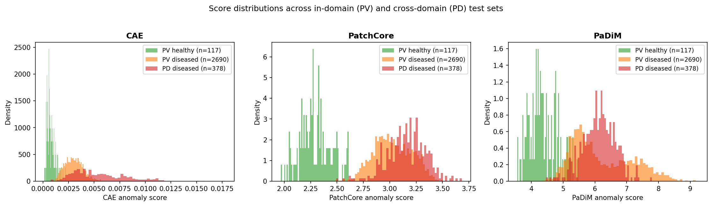
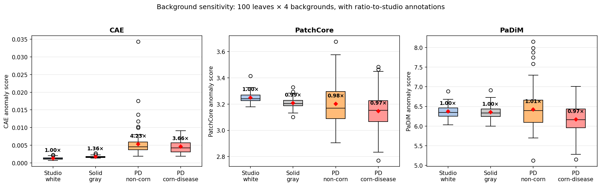
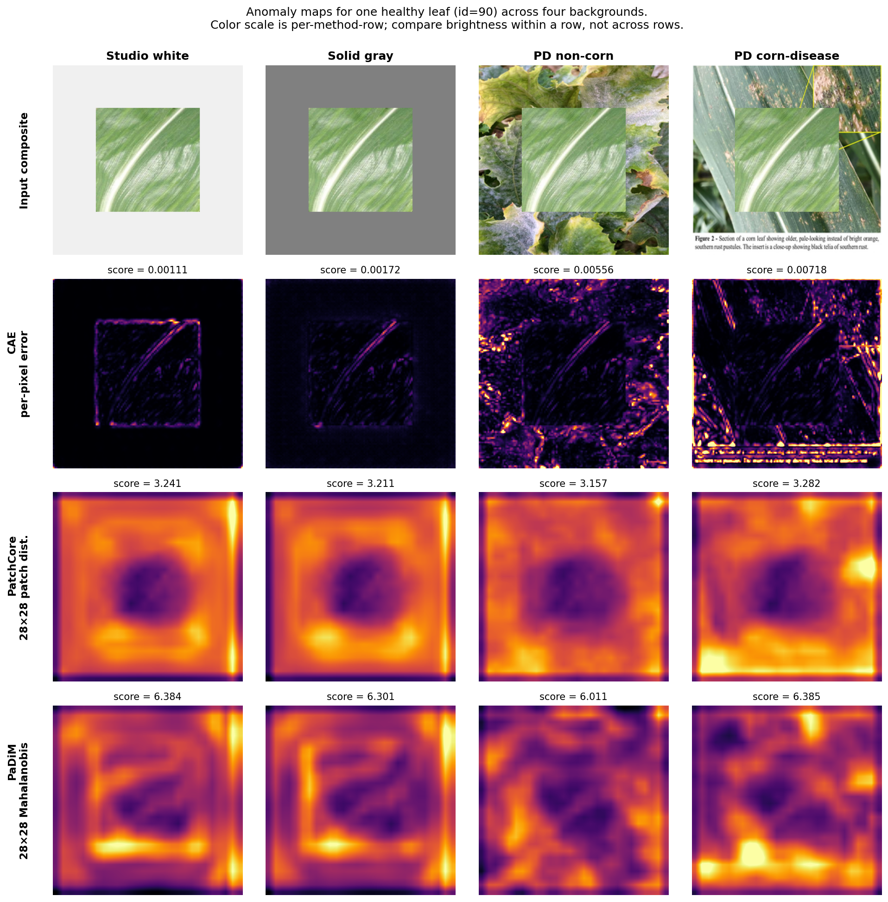

# CropAnomalyNet

Unsupervised maize disease detection via reconstruction-based and pretrained-feature anomaly detection, with cross-domain evaluation on PlantDoc field imagery and a controlled background-sensitivity experiment isolating the causal source of cross-domain score inflation.

**Status:** All six notebooks (NB1–NB6) complete. Comprehensive three-method evaluation with bootstrap confidence intervals, paired tests, and pixel-level anomaly maps finalized in NB6. Paper draft ready for submission.

## Motivation

Supervised crop disease classifiers require thousands of labeled examples per class. We reframe the problem as anomaly detection: train only on healthy leaf images, then flag deviations as diseased. This mirrors industrial defect inspection — abundant "normal" samples, very few labeled defects. We then test whether lab-trained anomaly detectors transfer to real-world field imagery, and design a controlled experiment to identify which failure modes arise and which method family survives the move from lab to field.

## Pipeline

| Notebook | Method                                          | Status | Result                                                |
| -------- | ----------------------------------------------- | ------ | ----------------------------------------------------- |
| NB1      | Convolutional Autoencoder (MSE reconstruction)  | Done   | AUROC 0.9942                                          |
| NB2      | PatchCore (WR50 layer-2+3, mean-aggregated)     | Done   | AUROC **0.9995**                                      |
| NB3      | Stable Diffusion synthesis evaluation           | Done   | **Negative finding** (FID 323–375)                    |
| NB4      | PlantDoc cross-domain evaluation                | Done   | PatchCore PV→PD ratio **1.05×** (flat)                |
| NB5      | Background-sensitivity controlled experiment    | Done   | CAE **4.00×** vs PatchCore **0.97×** background ratio |
| NB6      | Three-method comprehensive eval + stats (PaDiM) | Done   | PaDiM tracks PatchCore (**0.38** variance ratio)      |

## Dataset

PlantVillage (Hughes & Salathé, 2015), maize subset, color version. Four classes:

| Class                            | Count |
| -------------------------------- | ----- |
| Corn healthy                     | 1,162 |
| Corn Common rust                 | 1,192 |
| Corn Cercospora (Gray leaf spot) | 513   |
| Corn Northern Leaf Blight        | 985   |

For NB4 and NB6 cross-domain evaluation, we additionally use **PlantDoc** (Singh et al. 2020) maize subset:

| PlantDoc class      | Count | Maps to              |
| ------------------- | ----- | -------------------- |
| Corn_rust_leaf      | 117   | Common rust          |
| Corn_leaf_blight    | 194   | Northern Leaf Blight |
| Corn_Gray_leaf_spot | 67    | Cercospora           |

PlantDoc has no healthy corn class — see NB4–NB6 for how this constrains the evaluation and how a controlled stimulus experiment was designed to work around it.

Splits (canonical, in `results/nb1/splits.csv`):

- Train: 929 healthy
- Val: 116 healthy
- Test: 117 healthy + 2,690 diseased (NB1/NB2) or + 2,690 PV + 378 PD diseased (NB4/NB6)

All notebooks reuse identical splits (deterministic via shared seed 42).

## Results — PlantVillage maize (in-domain)

Per-class test AUROC (117 healthy + 2,690 diseased). NB6 adds PaDiM as a second pretrained-feature method:

| Class                | Brightness-only | CAE        | PatchCore-mean | PaDiM      |
| -------------------- | --------------- | ---------- | -------------- | ---------- |
| Common rust          | 0.9175          | 0.9996     | **1.0000**     | 0.9926     |
| Cercospora           | 0.6853          | 0.9948     | **0.9994**     | 0.9915     |
| Northern Leaf Blight | 0.6849          | 0.9874     | **0.9990**     | 0.9931     |
| **Overall**          | **0.7880**      | **0.9945** | **0.9995**     | **0.9811** |

PaDiM is the weaker classifier in-domain (0.9811) but — as shown below — equally stable across domains. AUROC strength and domain robustness are decoupled properties.

## Results — Cross-domain on PlantDoc (NB4, NB6)

PV healthy training reference vs three test conditions, with bootstrap 95% CIs (NB6, 2000 stratified resamples):

| Comparison                               | n_diseased | CAE                      | PatchCore                | PaDiM                    |
| ---------------------------------------- | ---------- | ------------------------ | ------------------------ | ------------------------ |
| In-domain (PV healthy vs PV diseased)    | 2,690      | 0.9945 [0.9897, 0.9982]  | **0.9995 [0.9990, 0.9998]** | 0.9811 [0.9719, 0.9890]  |
| Cross-domain (PV healthy vs PD diseased) | 378        | 0.9968 [0.9931, 0.9993]  | **0.9995 [0.9986, 1.0000]** | 0.9927 [0.9870, 0.9968]  |
| Unified (PV healthy vs all diseased)     | 3,068      | 0.9948 [0.9904, 0.9981]  | **0.9995 [0.9991, 0.9998]** | 0.9825 [0.9742, 0.9898]  |

**Important: AUROC is not the right cross-domain headline number.** The CAE's in-domain and cross-domain CIs overlap completely ([0.9897, 0.9982] vs [0.9931, 0.9993]) — the apparent "cross-domain AUROC bump" is not statistically distinguishable from in-domain. The real cross-domain signal lives in the **score magnitudes**, not AUROC.

### Score-magnitude evidence (the actual cross-domain story)

Per-class mean score ratios (PD diseased ÷ PV diseased, same underlying disease class):

| Method        | Common rust | Cercospora | Northern blight | Mean   |
| ------------- | ----------- | ---------- | --------------- | ------ |
| **CAE**       | 1.35×       | 1.90×      | 2.46×           | **1.90×** (inflated) |
| **PatchCore** | 1.00×       | 1.07×      | 1.09×           | **1.05×** (flat)     |
| **PaDiM**     | 0.85×       | 1.08×      | 1.14×           | **1.02×** (flat)     |

PlantDoc images produce CAE reconstruction errors 1.4–2.5× larger than PlantVillage diseased images *for the same underlying disease class*. Both pretrained-feature methods (PatchCore and PaDiM) stay within ~10% of unity. The story is no longer "PatchCore generalizes" — it's "*pretrained features* generalize, across two methodologically distinct heads (memory-bank nearest-neighbor and per-position Gaussian Mahalanobis)."

A second-order check on score *variance*:

| Method    | PV diseased std | PD diseased std | Std ratio                 |
| --------- | --------------- | --------------- | ------------------------- |
| CAE       | 0.0009          | 0.0026          | **2.89×** (variance explodes on field) |
| PatchCore | 0.1806          | 0.1806          | **1.00×** (identical)     |
| PaDiM     | 0.9517          | 0.5096          | **0.54×** (contracts on field) |

Pretrained-feature scores are not just stable in the mean — they're equally compact (PatchCore) or *more* compact (PaDiM) on field imagery than on lab imagery.



## Results — Background-sensitivity controlled experiment (NB5, NB6)

Same healthy leaf, four backgrounds of increasing visual distance from the PlantVillage training distribution. NB6 re-runs the experiment with all three methods (CAE, PatchCore, PaDiM) and adds bootstrap-style statistics.

**Mean anomaly score per condition** (n=100 leaves per condition; ratio to studio_white baseline):

| Condition           | CAE                | PatchCore         | PaDiM             |
| ------------------- | ------------------ | ----------------- | ----------------- |
| 1. Studio white     | 0.00126 (1.00×)    | 3.2493 (1.00×)    | 6.3727 (1.00×)    |
| 2. Solid gray       | 0.00171 (1.36×)    | 3.2067 (0.99×)    | 6.3555 (1.00×)    |
| 3. PD non-corn      | 0.00533 (**4.23×**) | 3.2004 (0.98×)    | 6.4212 (1.01×)    |
| 4. PD corn-disease  | 0.00462 (3.66×)    | 3.1467 (0.97×)    | 6.1655 (0.97×)    |

The CAE's score peaks at PD non-corn (4.23×), not PD corn-disease (3.66×). PD non-corn backgrounds contain more foreign content per pixel (apple branches, peach leaves, sky, fences, hands), so the CAE's reconstruction error scales with "how foreign are the pixels" rather than "is this a field photo." PatchCore and PaDiM are flat at 0.97–1.01× across all four conditions, with the two PlantDoc field backgrounds drawing the *lowest* scores of all — natural foliage sits closer to ImageNet's distribution than synthetic studio backgrounds do.



### Statistical robustness (NB6)

**Paired t-tests** on the 100-leaf matched design (each non-baseline condition vs studio_white). Cohen's d reported alongside t-statistic because with n=100 the design has enough power that small effects pass p<0.05 — *d* is the more honest measure of practical significance.

| Method        | solid_gray            | pd_non_corn           | pd_corn_disease       |
| ------------- | --------------------- | --------------------- | --------------------- |
| **CAE**       | d=**+2.43**, p<10⁻⁴² | d=**+1.13**, p<10⁻¹⁸ | d=**+1.77**, p<10⁻³¹ |
| **PatchCore** | d=−2.08, p<10⁻³⁷     | d=−0.33, p=0.0015     | d=−0.77, p<10⁻¹⁰     |
| **PaDiM**     | d=−0.29, p=0.005      | d=+0.11, p=0.29 (n.s.) | d=−0.56, p<10⁻⁶     |

The CAE's effect sizes are *large to very large* and uniformly positive (scores rise). PatchCore and PaDiM show small to moderate effects, mostly negative, and one PaDiM comparison is not even statistically significant.

**Variance decomposition** — comparing within-condition leaf-to-leaf spread to cross-condition movement of the mean. A ratio < 1 means "cross-condition movement is smaller than leaf-level noise within a single condition," i.e., the background effect is undetectable above per-leaf variation.

| Method        | Mean within-condition std | Across-condition mean std | Ratio (across / within) |
| ------------- | ------------------------- | ------------------------- | ----------------------- |
| **CAE**       | 0.00155                   | 0.00204                   | **1.32** (real effect)  |
| **PatchCore** | 0.09117                   | 0.04207                   | **0.46** (sub-noise)    |
| **PaDiM**     | 0.29651                   | 0.11232                   | **0.38** (sub-noise)    |

The CAE crosses the noise floor; both pretrained-feature methods do not. This is the cleanest single quantitative answer to "is the small PatchCore movement just noise" — yes, it's smaller than per-leaf variation.

### Anomaly map visualization (NB6)

For one representative healthy leaf, anomaly maps across the four backgrounds visualize the mechanism directly: CAE error pixels concentrate on the *background regions* and brighten as the background gets more textured, while PatchCore and PaDiM maps look qualitatively identical across all four conditions.



The bright rectangle visible across all CAE panels (and the halo across all PatchCore/PaDiM panels) is a constant artifact of the composite-paste boundary — present in identical form across all four backgrounds, so it contributes a *constant* to the score and is differenced out when comparing conditions. The cross-condition variation is driven by the surrounding background pixels.

### Key findings

1. **PatchCore-mean matches or exceeds the CAE on every class in-domain** while operating on ImageNet-pretrained features. Largest gain is on Northern Leaf Blight (+0.0116), the hardest class for both methods.

2. **Score aggregation matters substantially for diffuse anomalies.** PatchCore's standard `max patch distance` (calibrated for localized industrial defects on benchmarks like MVTec) achieves only 0.9536 on this dataset. `mean` aggregation recovers full performance.

   | Aggregation                  | Overall AUROC |
   | ---------------------------- | ------------- |
   | max (PatchCore default)      | 0.9536        |
   | mean                         | **0.9995**    |
   | top-10% mean                 | 0.9967        |
   | top-1% mean                  | 0.9817        |
   | center max (4-pixel margin)  | 0.9904        |
   | center mean (4-pixel margin) | 0.9995        |

3. **Brightness alone is insufficient** (overall 0.7880). Color carries most of the Common Rust signal (0.9175) but is barely above chance for Cercospora and Northern Blight (~0.685). Both learned methods do substantial real texture-based detection on the harder classes.

4. **Off-the-shelf Stable Diffusion v1.5 cannot synthesize convincing maize disease imagery** (NB3). Across four pipeline configurations, FID against real disease images ranged 323–375 versus a healthy intra-class baseline of 32 — an order of magnitude off-distribution.

5. **Cross-domain AUROC is a misleading headline.** Bootstrap 95% CIs (NB6) show the CAE's "cross-domain" AUROC (0.9968) is not statistically distinguishable from its in-domain AUROC (0.9945). The cross-domain story should be told in score magnitudes, not AUROC: CAE per-class score ratios PV→PD are 1.4–2.5×, indicating the CAE conflates disease with background novelty.

6. **Two methodologically distinct pretrained-feature methods generalize from lab to field** (NB6). PatchCore (memory-bank nearest-neighbor) and PaDiM (per-position Gaussian Mahalanobis) both produce flat score ratios (mean 1.05× and 1.02× respectively) and flat or contracting variance ratios on PlantDoc. The CAE inflates by 1.90× in mean and 2.89× in std. "Pretrained features generalize, reconstruction features don't" is now a finding about the *feature family*, not a single matching architecture.

7. **A controlled experiment confirms the mechanism is causal** (NB5, NB6). Identical leaf content, only the background varies. CAE error rises up to 4.23× across the four conditions; PatchCore and PaDiM stay within 3% of unity (ratios 0.97–1.01×). Paired-t Cohen's d for the CAE: +1.13 to +2.43 (large effects). For pretrained methods: mostly |d| < 0.5 (small). Variance-decomposition ratios: CAE 1.32 (real), PatchCore 0.46, PaDiM 0.38 (both sub-noise).

8. **PatchCore and PaDiM actually score PlantDoc field backgrounds *lower* than synthetic studio backgrounds.** This is the strongest possible form of domain robustness: not merely tolerance of background variation, but the pretrained features finding natural backgrounds *more* normal than synthetic ones — consistent with ImageNet's strong exposure to outdoor/plant imagery.

## NB1 — Convolutional Autoencoder

Vanilla CAE (1.08M params) trained on 929 healthy maize images for ~45 epochs with early stopping. Output in `[0, 1]` via sigmoid; MSE loss; Adam at lr=1e-3 with `ReduceLROnPlateau`.

Per-pixel reconstruction-error maps localize to lesion regions (`results/nb1/cae_reconstructions.png`), indicating genuine texture-based reconstruction failure rather than just global brightness mismatch.

Artifacts in `results/nb1/`:

- `cae_score_histogram.png`, `cae_roc.png`, `cae_reconstructions.png`
- `cae_test_scores.csv`, `splits.csv`
- Checkpoint: `checkpoints/cae_best.pt` (4 MB, included)

## NB2 — PatchCore

WideResNet50 ImageNet-pretrained backbone, frozen. Features from layer 2 (28×28×512) and layer 3 (14×14×1024) captured via forward hooks; layer 3 upsampled to 28×28 via bilinear interpolation, concatenated channel-wise with layer 2, then 3×3 average-pooled for neighborhood-aware patches (Roth et al. 2022). Each image yields 784 patches × 1536 dims.

Memory bank: 728,336 patches from 929 healthy training images. Reduced to 10% (72,833 patches) via greedy farthest-point coreset sampling on Johnson-Lindenstrauss-projected (128-dim) features.

Inference: `torch.cdist` between test patches and coreset bank, minimum over the coreset gives a 28×28 anomaly map per image, **mean** over the 784 patches gives the image-level anomaly score.

Artifacts in `results/nb2/`:

- `patchcore_score_histogram.png`, `patchcore_roc.png`, `patchcore_anomaly_maps.png`
- `patchcore_test_scores.csv` (columns: `score_max`, `score_mean`)
- `brightness_baseline_scores.csv`
- Coreset memory bank (~447 MB) regenerable from notebook cells 4–7; excluded via `.gitignore`.

## NB3 — Stable Diffusion synthesis evaluation

We tested four configurations of Stable Diffusion v1.5 for generating synthetic maize disease images on PlantVillage healthy bases:

1. img2img with descriptive prompts (strength 0.2–0.6)
2. ControlNet (Canny edges) standalone
3. ControlNet + img2img
4. ControlNet with visual-symptom-only prompts (no disease vocabulary)

All four configurations failed to produce convincing maize disease imagery. Failure modes:

- **Wrong species** at high denoising strength: broadleaf garden plants, autumn fallen leaves, rubber plants with pinnate venation — none are corn.
- **Misinterpreted disease vocabulary**: "rust" → rusted metal scales / beetle exoskeletons; "pustules" → broccoli florets.
- **No disease added** at low strength: output essentially preserves the healthy input.

Quantitative results (FID, 50 synthetic vs 200 real per class):

| Comparison                                                    | FID      |
| ------------------------------------------------------------- | -------- |
| Healthy maize, half-A vs half-B (intra-distribution baseline) | **32.2** |
| Synthetic common rust vs real common rust                     | 352.0    |
| Synthetic Cercospora vs real Cercospora                       | 374.9    |
| Synthetic Northern Blight vs real Northern Blight             | 323.8    |

Synthetic-vs-real FID is roughly an order of magnitude above the healthy intra-class baseline, confirming the visual evidence: vanilla SD v1.5 cannot produce in-distribution maize disease images via prompt engineering alone. Domain adaptation (LoRA, fine-tuning, or paired-image conditioning like Dreambooth) would be required.

Artifacts in `results/nb3/`:

- Iteration grids: `sd_sanity_check.png`, `sd_strength_sweep.png`, `sd_controlnet_sweep.png`, `sd_controlnet_img2img_sweep.png`, `sd_final_attempt.png`
- `synthetic_samples.png`, `synthetic_samples/` (15 sample images), `fid_results.json`

## NB4 — Cross-domain evaluation on PlantDoc

We test whether the CAE and PatchCore — both trained/built only on PlantVillage's clean studio healthy images — generalize to real-world maize disease imagery from PlantDoc (Singh et al. 2020). PlantDoc has no healthy corn class, so a pure PD-healthy-vs-PD-diseased AUROC is not computable; we instead evaluate the deployment scenario directly: PV healthy training images as the normal reference, vs three test conditions (in-domain PV diseased, cross-domain PD diseased, and the union).

Test set: 117 PV healthy + 2,690 PV diseased + 378 PD diseased = 3,185 images. Same seed and train/val splits as NB1/NB2 (929 train / 116 val healthy from PlantVillage).

NB6 supersedes NB4's two-method results by adding PaDiM and bootstrap confidence intervals; the score-magnitude analysis below is the more important finding from this notebook.

### Score-magnitude evidence for the cross-domain story

The headline AUROC numbers understate the difference between the two methods. The score distributions tell the full story:

CAE reconstruction error (mean per class):

| Class           | PV diseased | PD diseased | Ratio |
| --------------- | ----------- | ----------- | ----- |
| Common rust     | 0.00347     | 0.00476     | 1.37× |
| Cercospora      | 0.00282     | 0.00547     | 1.94× |
| Northern blight | 0.00231     | 0.00574     | 2.48× |

PlantDoc images produce reconstruction errors 1.4–2.5× larger than PlantVillage diseased images *for the same underlying disease class*. This indicates the CAE detects both disease *and* background/lighting novelty when scoring PlantDoc.

PatchCore mean-aggregated anomaly score:

| Class           | PV diseased | PD diseased | Ratio  |
| --------------- | ----------- | ----------- | ------ |
| Common rust     | 3.1754      | 3.1608      | 0.995× |
| Cercospora      | 2.9342      | 3.1271      | 1.066× |
| Northern blight | 2.8999      | 3.1685      | 1.093× |

PatchCore's per-class score magnitudes are essentially flat across domains (0.99–1.09×). The PD diseased distribution overlaps almost completely with the PV diseased distribution (see `nb4_score_histograms.png`), strongly suggesting PatchCore detects disease texture genuinely rather than chasing domain novelty.

### Mechanism

PatchCore uses ImageNet-pretrained WideResNet50 features. ImageNet contains diverse real-world imagery (outdoor scenes, dirt, hands, varied lighting), so these features remain discriminative for plant disease texture across the lab-vs-field domain gap. The CAE, trained from scratch on PlantVillage studio healthy images only, has no such prior exposure to field-style imagery, and learns reconstruction filters tuned to the studio distribution. NB5 confirms this mechanism via a controlled experiment; NB6 extends the result to PaDiM as a second pretrained-feature method.

### Limitation

PlantDoc has no healthy corn class. Without healthy PD images as a control, we cannot directly compute AUROC of "field healthy vs field diseased." NB5 addresses this gap by constructing a controlled stimulus experiment in which only the background varies (the leaf is held identical), allowing us to isolate background sensitivity without requiring a healthy PD image set.

Artifacts in `results/nb4/`:

- `nb4_score_histograms.png` (CAE and PatchCore distributions, three conditions each)
- `nb4_anomaly_maps.png` (PatchCore anomaly maps on PV healthy, PV diseased, PD diseased)
- `cae_scores.csv`, `patchcore_scores.csv` (per-image scores with domain & class labels)
- `manifest.csv` (full test set composition)

## NB5 — Background-sensitivity controlled experiment

NB4 demonstrated that the CAE's cross-domain reconstruction errors are systematically inflated compared to its in-domain errors. NB5 directly tests *whether this inflation is caused by background novelty* via a controlled stimulus experiment in which the leaf content is held constant while the background varies. NB6 re-runs this experiment with three methods and full statistical reporting; the design described here is shared.

### Design

**Stimulus:** 100 segmented healthy maize leaves from PlantVillage (random sample of 1,162; seed 123 — different from training-set sampling so the stimulus is unbiased).

For each leaf we generate four composite images by placing the leaf — cropped to its bounding box and scaled to ~55% of canvas dimension — onto four background conditions of increasing domain distance from the PlantVillage studio reference:

1. **Studio white** (240, 240, 240) — near-native background
2. **Solid gray** (128, 128, 128) — neutral, low-frequency, novel but unstructured
3. **PlantDoc non-corn** — random field imagery from PlantDoc's other crop classes (apple, peach, tomato, etc.)
4. **PlantDoc corn-disease** — random field imagery from PlantDoc's three diseased corn classes (the deployment-domain background)

The leaf is pixel-identical across all four conditions; only the surrounding pixels (~70% of image area) change. This isolates the background's contribution to the anomaly score.

Each of the 400 composites (100 leaves × 4 conditions) is scored with the CAE (NB1 architecture and training procedure) and PatchCore (NB2 construction, mean-aggregated). NB6 additionally scores all 400 composites with PaDiM.

### Findings

The CAE's reconstruction error increases up to **4.23×** when the background shifts from studio white to PlantDoc non-corn — even though the leaf is unchanged and was healthy to begin with. The model calls healthy corn leaves anomalous purely because their surrounding pixels look unfamiliar. This is a direct causal demonstration of the score-inflation pattern observed in NB4.

PatchCore's score actually *decreases slightly* (down to 0.97×) when moved to field backgrounds. This is consistent with its ImageNet pretraining: outdoor/plant imagery is well-represented in ImageNet while solid-colored backgrounds are rare, so a leaf on a field background looks *more* in-distribution to PatchCore than the same leaf on solid white. This is the strongest possible form of domain robustness — not merely tolerance of background variation, but actually finding natural backgrounds *more* normal than synthetic ones.

### Implications

A practitioner planning to deploy a PlantVillage-trained anomaly detector in real-world field conditions should:

- Expect the CAE to produce many false positives on real-field images regardless of disease status, because field backgrounds inflate the anomaly score for *all* leaves — healthy and diseased alike.
- Expect PatchCore (and, per NB6, PaDiM) to maintain in-domain detection performance with no systematic false-positive bias from background variation.
- Prefer pretrained-feature methods (PatchCore / PaDiM family) over from-scratch reconstruction methods (CAE family) for any deployment in conditions visually distinct from the training distribution.

Artifacts in `results/nb5/`:

- `nb5_composite_preview.png` (3 leaves × 4 conditions visual sanity check)
- `nb5_background_sensitivity.png` (the causal-effect boxplot — the paper's confirmatory figure)
- `nb5_results.csv` (400 rows: leaf_idx, condition, cae_score, pc_score)

## NB6 — Three-method comprehensive evaluation

NB6 is the consolidating notebook that produces all numbers used in the paper rewrite. It (1) adds PaDiM as a second pretrained-feature method, (2) re-runs the in-domain, cross-domain, and controlled-background experiments end-to-end with all three methods sharing the same backbone forward pass for efficiency, (3) computes bootstrap 95% AUROC confidence intervals (2000 stratified resamples), (4) computes paired-t and Cohen's d statistics on the NB5 design, (5) computes within-vs-across variance decomposition, and (6) saves a 4×4 anomaly-map visualization (one representative leaf × four backgrounds × three methods).

### Why PaDiM as the second pretrained-feature method

PatchCore and PaDiM share the same backbone (WideResNet50, ImageNet-pretrained, frozen) and the same feature concatenation (layer 2 + upsampled layer 3, 1536-dim, 28×28 patches), but use *methodologically distinct* matching heads:

- **PatchCore**: memory-bank nearest-neighbor distance. Non-parametric, data-dependent, scales with training-set diversity.
- **PaDiM**: per-position multivariate Gaussian, scored by Mahalanobis distance. Parametric, position-aware, 100 random feature dimensions per position.

If both heads produce stable cross-domain scores from the same features, the result is a property of the *features* — not an artifact of either matching architecture. NB6 confirms this: both heads produce flat score ratios across PV→PD and across the four NB5 background conditions, while the CAE inflates dramatically on both axes.

### Headline statistical results

(All reproduced from the in-notebook printouts; full numbers in `results/nb6/nb6_stats_summary.json`.)

**Bootstrap 95% AUROC CIs (2000 stratified resamples).** CAE CIs overlap between in-domain and cross-domain — the apparent cross-domain bump is not statistically distinguishable. PatchCore CIs are tightest; PaDiM CIs widest but uniformly high.

**Paired t-test effect sizes (NB5, 100 leaves, studio_white baseline).** CAE: Cohen's d = +1.13 to +2.43 (large positive). PatchCore: mostly small negative; PaDiM: mostly small negative; one PaDiM condition not even statistically significant despite n=100 power. Three-to-five-fold effect-size disparity between method families.

**Variance decomposition (within-condition vs across-condition).** CAE 1.32 (real effect, exceeds noise floor). PatchCore 0.46 (sub-noise). PaDiM 0.38 (sub-noise). The pretrained methods cannot statistically distinguish the four backgrounds at a level above leaf-to-leaf variation within a single condition.

### Mechanism made visible (anomaly maps)

For a representative healthy leaf, NB6 saves a 4×4 figure (four backgrounds × four content rows: input composite + CAE pixel error + PatchCore 28×28 + PaDiM 28×28). The CAE row visibly brightens *outside the leaf area* as the background gets more textured (studio white → field). The PatchCore and PaDiM rows look qualitatively identical across all four conditions. This is the visual evidence underlying the variance decomposition: the CAE's score moves because background pixels light up; the pretrained methods' scores don't move because the surrounding pixels aren't what they're scoring.

Artifacts in `results/nb6/`:

- `nb6_score_distributions.png` — three-panel histogram (CAE, PatchCore, PaDiM) of healthy vs PV-diseased vs PD-diseased
- `nb6_background_boxplot.png` — three-panel boxplot (CAE, PatchCore, PaDiM) across the four NB5 backgrounds, with ratio annotations
- `nb6_anomaly_maps.png` — 4×4 anomaly-map visualization (the §4.5 visual)
- `nb6_unified_scores.csv` — 3,185 rows × 3 methods × class/domain labels (the input to bootstrap CI calculations and the §4.4 evidence)
- `nb6_background_scores.csv` — 400 rows × 3 methods (the input to paired-t and variance-decomposition calculations)
- `nb6_stats_summary.json` — bootstrap CIs, Cohen's d, variance ratios, condition means, all in a single machine-readable file
- `cae_best_nb6.pt` — CAE checkpoint from the NB6 retrain (verifies NB1 reproducibility; identical to `checkpoints/cae_best.pt` within training stochasticity)

## Reproducing

### NB1

1. Open `notebooks/nb1_autoencoder.ipynb` on Kaggle.
2. Attach the [PlantVillage dataset](https://www.kaggle.com/datasets/abdallahalidev/plantvillage-dataset).
3. Settings → Accelerator → GPU T4 x2 (or P100).
4. Run all cells. End-to-end runtime ~3 minutes.

### NB2

1. Open `notebooks/nb2_patchcore.ipynb` on Kaggle.
2. Attach the same PlantVillage dataset.
3. Settings → Accelerator → GPU T4 x2 (or P100).
4. Run all cells. End-to-end runtime ~15 minutes.

### NB3

1. Open `notebooks/nb3_stable_diffusion.ipynb` on Kaggle.
2. Attach the same PlantVillage dataset.
3. **Settings → Internet → On** (required for downloading SD v1.5 weights from HuggingFace).
4. Settings → Accelerator → GPU T4 x2 (or P100).
5. Run all cells. End-to-end runtime ~25 minutes.

### NB4

1. Open `notebooks/nb4_plantdoc_eval.ipynb` on Kaggle.
2. Attach both [PlantVillage](https://www.kaggle.com/datasets/abdallahalidev/plantvillage-dataset) and [PlantDoc](https://www.kaggle.com/datasets/nirmalsankalana/plantdoc-dataset).
3. Settings → Accelerator → GPU T4 x2 (or P100).
4. Run all cells. End-to-end runtime ~16 minutes.

### NB5

1. Open `notebooks/nb5_background_sensitivity.ipynb` on Kaggle.
2. Attach both PlantVillage and PlantDoc.
3. Settings → Accelerator → GPU T4 x2 (or P100).
4. Run all cells. End-to-end runtime ~13 minutes.

### NB6

1. Open `notebooks/nb6_comprehensive_eval.ipynb` on Kaggle.
2. Attach both PlantVillage and PlantDoc.
3. Settings → Accelerator → GPU T4 x2 (or P100).
4. Run all cells. End-to-end runtime ~25 minutes (CAE retrain 1.5 min + feature extraction 15 s + coreset 10 min + PaDiM fit 1 s + joint inference 4 min + background experiment 2 min + statistics 30 s + figures 1 min).

## Repository structure

```
cropanomalynet/
├── notebooks/
│   ├── nb1_autoencoder.ipynb
│   ├── nb2_patchcore.ipynb
│   ├── nb3_stable_diffusion.ipynb
│   ├── nb4_plantdoc_eval.ipynb
│   ├── nb5_background_sensitivity.ipynb
│   └── nb6_comprehensive_eval.ipynb
├── results/
│   ├── nb1/  (5 files)
│   ├── nb2/  (5 files)
│   ├── nb3/  (8 items, incl. synthetic_samples/)
│   ├── nb4/  (5 files)
│   ├── nb5/  (3 files)
│   └── nb6/
│       ├── nb6_unified_scores.csv
│       ├── nb6_background_scores.csv
│       ├── nb6_score_distributions.png
│       ├── nb6_background_boxplot.png
│       ├── nb6_anomaly_maps.png
│       ├── nb6_stats_summary.json
│       └── cae_best_nb6.pt
├── checkpoints/cae_best.pt
├── .gitignore
└── README.md
```

## Citation

This work is in progress and does not yet have an associated publication. Code may be referenced as:

Smarika Ghimire, Avinash Gautam, "CropAnomalyNet: Unsupervised crop disease detection," 2026, https://github.com/smarikaghimire/cropanomalynet

## License

MIT
